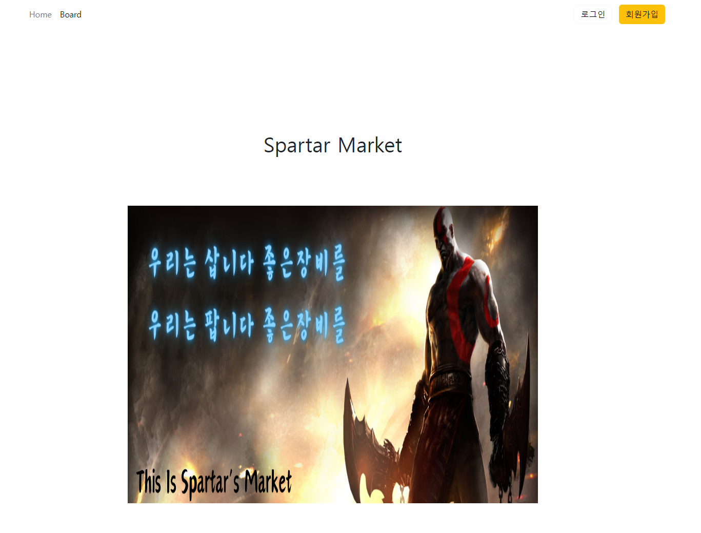
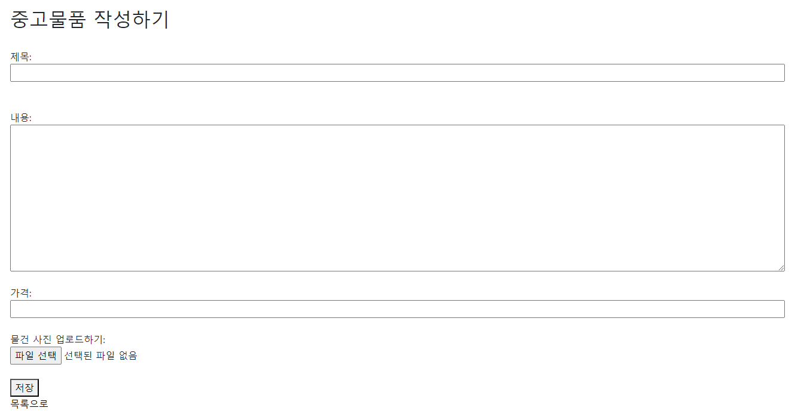
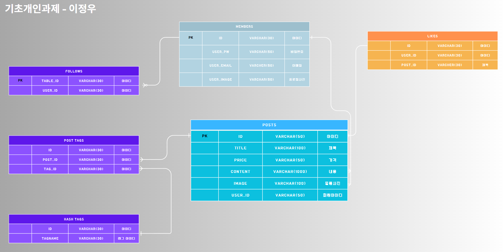

# Spartar Market Project
# Project Name
- 강한 사람들만 오는 Spartar Market
# Project Summary

# 회원기능

- 회원가입, 회원탈퇴, 로그인, 로그아웃

# 유저기능
- Index page
    1.Home, Board 연결

- 게시판 Page

    1. 글작성 가능

- Profile Page 기능

- Like 기능

- 좋아하는 상품 찜 기능

- Follow 기능

    1.Follow가 몇명인지 확인 가능한 기능
    2.Follow, Unfollow 기능

# 활용한 기술스택
  
 
 

&nbsp

# 개발기간 

2024-04-17 ~ 2024-04-19

# ERD

